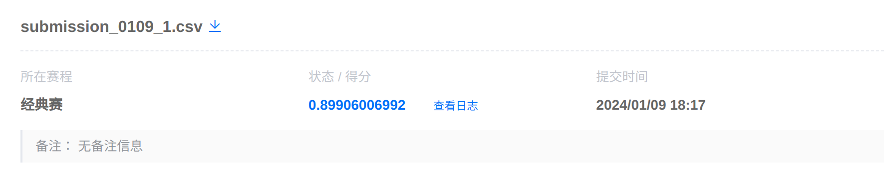

高级人工智能大作业——返乡发展人群预测
==========

## 说明

我们探索了ELM与集成学习两种学习方法，最终集成学习方法取得的结果更好一些，因此我们选择使用集成学习的结果，并将 ELM 学习的代码放在这里供参考。

文件及目录：
* data：原始数据；
* ELM：ELM算法实现；
* newdata：执行特征变换后，新数据的存放位置，初始不存在，会自动创建；
* result：默认的预测结果保存位置；
* ai_homework.py：集成学习方法的代码实现；
* ai_homework.ipynb：集成学习实现方法的 notebook 版本；


## 运行环境配置

```
conda create -n aip
conda activate aip
conda install python=3.6.13
pip install -r requirements.txt
```

## 训练方法

1. 首先执行 `python pre_process.py` 进行特征变换，生成新的 dataB.csv、dataTrain.csv以及 label.csv 保存在 newdata 目录中；
2. 上述步骤同时会将 data/submit_example_B.csv 复制一份到 result/submission.csv 中，用于保存预测结果；
3. 执行 `python ai_homework.py` 进行训练及预测，结果保存在 result/submission.csv 文件中；

## 训练结果

训练输出：

> auc = 0.90942848
> Model = StackingClassifier
>
> - KFold = 0, val_auc = 0.9073
> - KFold = 1, val_auc = 0.9092
> - KFold = 2, val_auc = 0.9153
> - KFold = 3, val_auc = 0.9053
> - KFold = 4, val_auc = 0.9059 
>
> - KFold = 5, val_auc = 0.9085
> - KFold = 6, val_auc = 0.9006
> - KFold = 7, val_auc = 0.9173
> - KFold = 8, val_auc = 0.9155
> - KFold = 9, val_auc = 0.9133
> Overall Model = StackingClassifier, AUC = 0.9097

平台验证：
