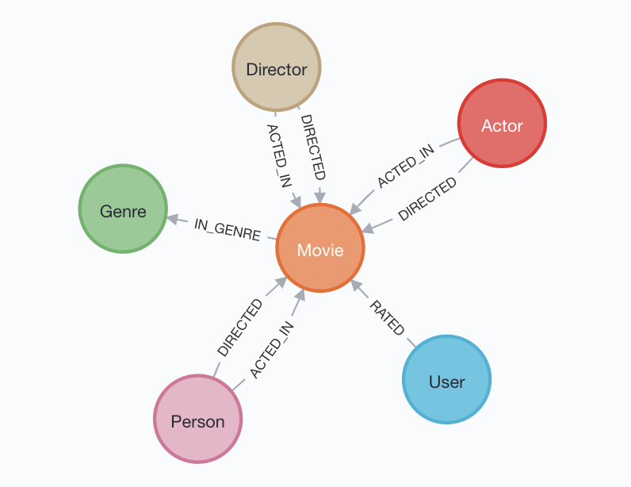

## LLaMA2Cypher

### 环境配置与运行

```
conda install python=3.10.11
git clone git@github.com:huggingface/transformers.git
cd transformers
pip install .
cd <PATH_TO_LLaMA2Cypher>
pip install -r requirements.txt

# 配置文件，用于配置 prompt 等，可根据需要进行调整
cp config_example.py config.py

# web mode default on http://127.0.0.1:7863
python demo_web.py --checkpoint <path_to_model>

# interactive mode in terminal
python demo_cmd.py --checkpoint <path_to_model> --lang en
```

其中 web 服务默认在 127.0.0.1:7863 上，如果需要远程访问，需要自行修改 ip 地址，并开放相应端口；建议使用 nginx 等代理软件进行配置。

参数说明：

* --checkpoint 用于指定模型目录，支持 llama/llama-2 格式的模型，需要是 huggingface 格式；实测支持 7B/13B 两种规格，理论上也支持其它规格，由于硬件限制未进行尝试；
* --datapath 用于指定 schema.txt 所在的目录，默认为 data；
* --lang 仅在命令行交互模式下可用，用于加载对应语言的 prompt；仅支持 en/cn 两种语言，默认为 en；
* --port 仅 web 模式下可用，用于设置 web 服务的侦听端口。


### 使用的 LLM 

主要使用 [LLaMA2-7B-hf](https://huggingface.co/meta-llama/Llama-2-7b-chat-hf) 进行实验。

用于对比实验的 LLM

* [Chinese-LlaMA2-chat-7B-sft-v0.3](https://huggingface.co/michaelwzhu/Chinese-LlaMA2-chat-7B-sft-v0.3)（[github](https://github.com/michael-wzhu/Chinese-LlaMA2)）；

* [lawyer-llama-13b-beta1.0](https://huggingface.co/pkupie/lawyer-llama-13b-beta1.0)（[github](https://github.com/AndrewZhe/lawyer-llama)）；

* [replicate LLaMA2-70B](https://replicate.com/)；

* [ngql-gpt](https://ngql-gpt.siwei.io/)（[github](https://github.com/wey-gu/NebulaGraph-GPT)）；


### 关于数据


数据基于 Neo4j 官方给出的在线 demo 图数据库 [Movie Graph](https://demo.neo4jlabs.com:7473)，用户名：recommendations，密码：recommendations，数据库：recommendations。

简易 schema 如下图：



其中 Movie 表示电影，Director 是导演，Actor 是演员，Person 是 Director 与 Actor 的并集，且 Director 与 Actor 存在交集。

*data/cypher.txt* 文件中的 12 个问题也取自 Neo4j 关于 Movie Graph 的官方教程中的示例，通过在上述在线交互界面中输入`:play movie-graph
`即可看到。

由于数据为教程中为展示数据库特性而设置的，其优点是从简单到复杂的语句都有，缺点是对于太复杂的语句，用自然语言都不太方便描述。在进行 NL2Cypher 的任务中，要把这些复杂的 Cypher 语句用自然语言表述出来都不太容易，可见对于专业性比较强的问题，还是适合使用更加严谨的结构化表达。NL2Cypher 更适合处理一些语义明确并且直接的自然语言。对于复杂的问题，即使可以用自然语言表述，其输出结果也很难控制——实际上，这些描述复杂问题的自然语言，即使是交给一个没有受过专业训练的人类去理解，都未必准确，更别说 LLM 了。

不过，这也并非意味着 LLM 完全无法解决此类问题。对于那些复杂的问题，实际上可以拆分成一些简单的步骤，各个步骤之间的约束，以及最终结果的表达，由人工进行整理。虽然对用户来说，这样做似乎复杂了一些，但是也不失为一种解决问题的方法。

对数据文件的说明如下：
* data/cypher.txt 原始 Cypher 语句；
* data/expert_cn.txt 以对 Cypher 语言有一定了解的专业人员的思维，用中文表达的问题；
* data/expert_en.txt 以对 Cypher 语言有一定了解的专业人员的思维，用英文表达的问题；
* data/user_cn.txt 以普通用户的思维，用中文表达的问题；
* data/user_en.txt 以普通用户的思维，用英文表达的问题；


### 实验结果

完整实验记录：

* result/example_result_lawyer_llama_13B_expert_cn.txt 使用中文提示及问题，在 lawyer_llama_13B 上的测试结果（本地部署）；
* result/example_result_lawyer_llama_13B_expert_en.txt 使用英文提示及问题，在 lawyer_llama_13B 上的测试结果（本地部署）；
* result/example_result_llama2_70B_expert_cn.txt 使用中文提示及问题，在 llama2_70B 上的测试结果（在线API）；
* result/example_result_llama2_70B_expert_en.txt 使用英文提示及问题，在 llama2_70B 上的测试结果（在线API）；
* result/example_result_llama2_7B_expert_cn.txt 使用中文提示及问题，在 llama2_7B 上的测试结果（本地部署）；
* result/example_result_llama2_7B_expert_en.txt 使用英文提示及问题，在 llama2_7B 上的测试结果（本地部署）；
* result/example_result_nGQL_GPT_expert_cn.txt 使用中文提示及问题，在 nGQL_GPT 上的测试结果（在线API）；
* result/example_result_nGQL_GPT_expert_en.txt 使用英文提示及问题，在 nGQL_GPT 上的测试结果（在线API）；

我们用三个等级来评价转换结果：

* A 表示完全或者基本正确，允许在条件或者返回格式上有一些错误；
* B 表示部分正确，虽然结果并非完全正确，但是部分理解了问题，结果有一定的参考价值；
* C 表示完全错误，对问题理解有误，或者输出内容混乱，几乎没有参考价值。


实验评价：

todo: tables

